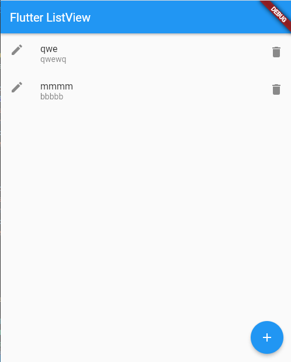
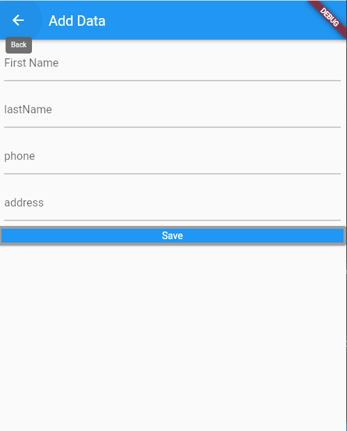
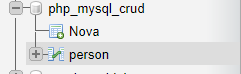

# flutter_php_mysql_crud_shajedul

# CRUD simples com FLUTTER, DART, PHP, MYSQL
- Este projeto é feito a partir do video do Shajedul Islam Shawon do youtube, porém com algumas modificações por causa de partes obsoletas e incluindo header do PHP não mencionado no vídeo.
https://www.youtube.com/watch?v=GMPa_9A0hcU&t=1s

## Getting Started

- [XAMPP](https://www.apachefriends.org/pt_br/index.html)

- [Lab: Write your first Flutter app](https://docs.flutter.dev/get-started/codelab)
- [Cookbook: Useful Flutter samples](https://docs.flutter.dev/cookbook)

For help getting started with Flutter development, view the
[online documentation](https://docs.flutter.dev/), which offers tutorials,
samples, guidance on mobile development, and a full API reference.
